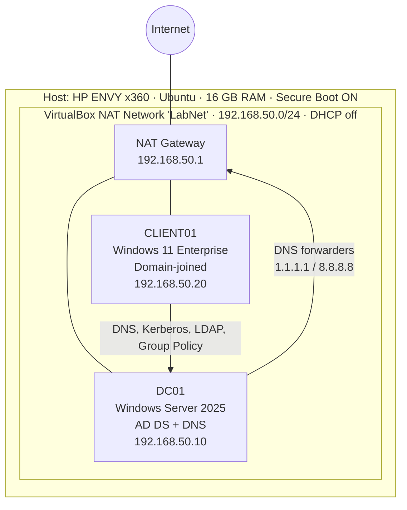

# Windows Active Directory & Security Homelab

A small enterprise-style Windows environment built on VirtualBox to practice systems administration, Active Directory, DNS, Group Policy, and security hardening — with every security control tested and documented.

**Skills demonstrated:** Active Directory Domain Services · DNS · Group Policy · PowerShell · Windows Server 2025 · Windows 11 Enterprise · Windows Firewall · Least privilege / RBAC · UEFI Secure Boot & TPM 2.0 · VirtualBox 7.2 / VBoxManage · Linux (Ubuntu) host administration

---

## Architecture



| Machine  | OS                                   | Role                                     | IP             | vCPU / RAM / Disk |
|----------|--------------------------------------|------------------------------------------|----------------|-------------------|
| Host     | Ubuntu (HP ENVY x360, 16 GB)         | VirtualBox hypervisor                    | —              | —                 |
| DC01     | Windows Server 2025 Standard (Eval), Desktop Experience | Domain controller, AD DS, DNS, Global Catalog | 192.168.50.10 | 2 / 3 GB / 60 GB |
| CLIENT01 | Windows 11 Enterprise (Eval)         | Domain-joined workstation (UEFI, TPM 2.0, Secure Boot) | 192.168.50.20 | 2 / 4 GB / 64 GB |

- **Network:** Isolated VirtualBox NAT Network with static IPs (DHCP disabled so clients can't receive the wrong DNS server)
- **Domain:** `lab.local` (NetBIOS: `LAB`), forest/domain functional level Windows Server 2025
- **DNS design:** CLIENT01 uses DC01 as its *only* DNS server; DC01 points to itself (own IP, then loopback) and forwards external queries to 1.1.1.1 / 8.8.8.8

---

## Build Summary

1. **Hypervisor setup:** Installed VirtualBox from Oracle's official APT repository on Ubuntu with UEFI Secure Boot left **enabled**; signed and enrolled a Machine Owner Key (MOK) so the kernel would load VirtualBox's modules.
2. **Network:** Created an isolated NAT Network (`LabNet`) via `VBoxManage` with DHCP disabled.
3. **VM provisioning:** Built both VMs from the command line with `VBoxManage` (UEFI firmware; TPM 2.0 + Secure Boot on the Windows 11 client).
4. **Domain controller:** Installed Windows Server 2025, set static IP / hostname / time zone with PowerShell, installed AD DS, and promoted DC01 to the first DC of a new forest (`lab.local`) with integrated DNS.
5. **DNS verification:** Confirmed the `_ldap._tcp.dc._msdcs.lab.local` SRV record, configured DNS forwarders, and tested internal + external resolution.
6. **Directory structure:** Created OUs, test users, a separate named admin account, and security groups; redirected new computer accounts to a dedicated OU with `redircmp`.
7. **Client:** Installed Windows 11 Enterprise, set static IP with DC01 as DNS, joined `lab.local` using the named admin account, and verified domain-user login.
8. **Security hardening:** Configured Group Policy for passwords, account lockout, screen lock, Windows Firewall, and least privilege.
9. **Validation:** Tested every control and captured evidence.

---

## Active Directory Structure

```
lab.local
├── Domain Controllers
│   └── DC01
├── LAB-Users
│   ├── IT
│   │   ├── John Smith (jsmith)        → IT-Helpdesk
│   │   └── Sabesen Admin (adm.sabesen) → Domain Admins
│   └── Staff
│       ├── Alice Wong (awong)         → Staff
│       └── Maya Patel (mpatel)        → Staff
├── LAB-Computers
│   └── CLIENT01
└── LAB-Groups
    ├── IT-Helpdesk (Global Security)
    └── Staff (Global Security)
```

- **Separate admin account:** Daily admin work uses the named account `adm.sabesen` (clear audit trail) instead of the built-in Administrator.
- **Computer redirection:** `redircmp` sends newly joined computers to `LAB-Computers` instead of the default `Computers` container, which cannot have GPOs linked to it.

---

## Security Controls Implemented

| Control | Where | Setting |
|---|---|---|
| Password policy | Default Domain Policy (domain-linked) | Min length 12 · complexity on · history 24 · max age 90 days · min age 1 day |
| Account lockout | Default Domain Policy (domain-linked) | 10 invalid attempts · 15 min lockout · 15 min counter reset |
| Screen lock | LAB-Workstation-Security → LAB-Computers | Interactive logon: Machine inactivity limit = 300 s |
| Windows Firewall | LAB-Workstation-Security → LAB-Computers | On for Domain/Private/Public · inbound Block · outbound Allow · enforced by policy |
| Least privilege / RBAC | LAB-Workstation-Security → LAB-Computers (GP Preferences) | Only `LAB\IT-Helpdesk` added to local Administrators; Staff remain standard users |
| Separate admin identity | Active Directory | Named admin account (`adm.sabesen`) for privileged tasks |
| Platform security | CLIENT01 VM + host | UEFI, TPM 2.0, Secure Boot on client; Secure Boot kept on for the host |

**Design notes**
- Password and lockout policies for domain accounts only take effect from a GPO linked at the **domain** level — which is why they live in the Default Domain Policy, not the workstation GPO.
- Lockout threshold of 10 matches Microsoft's current default: it still stops password guessing (especially with a 12-character minimum) while reducing accidental lockouts and helpdesk tickets. Stricter baselines such as CIS recommend 5 or fewer.
- NIST SP 800-63B recommends against forced periodic password changes unless compromise is suspected; the 90-day maximum age reflects what many organizations still require.

---

## Tests Performed

| # | Control | Test | Expected | Result | Evidence |
|---|---|---|---|---|---|
| 1 | GPO delivery | `gpresult /r /scope computer` on CLIENT01 | Default Domain Policy + LAB-Workstation-Security applied | ✅ Pass | `20-gpresult-client.png` |
| 2 | Windows Firewall | `Get-NetFirewallProfile -PolicyStore ActiveStore`; ping + TCP 3389 from DC01 to CLIENT01 | All profiles on, inbound Block, network = DomainAuthenticated; ping/RDP blocked | ✅ Pass | `18-test-firewall-domain-profile.png` |
| 3 | Screen lock | Registry check (`InactivityTimeoutSecs = 0x12c`) + 5 min idle | Workstation locks automatically | ✅ Pass | `17-test-screen-lock.png` |
| 4 | Password policy | Reset `awong` to a 10-char password with no symbol | Rejected by domain policy | ✅ Pass | `15c-test-weak-password-rejected.png` |
| 5 | Least privilege | `awong` (Staff) opens Terminal (Admin) | UAC demands admin credentials; not in Administrators | ✅ Pass | `19-test-least-privilege.png` |
| 6 | Account lockout | 10 bad passwords for `LAB\mpatel` | Account locked; Security Event 4740 on DC01; unlocked with `Unlock-ADAccount` | ✅ Pass | `16-test-account-lockout.png`, `16b-lockout-event-and-unlock.png` |
| — | Domain join / auth | Log in as `LAB\jsmith`; `whoami`, `$env:LOGONSERVER`, `nltest /dsgetdc:lab.local` | `lab\jsmith`, `\\DC01`, DC located | ✅ Pass | `12-domain-user-login-whoami.png` |
| — | DNS / DC discovery | SRV lookup, LDAP 389 test, external resolution from CLIENT01 | All succeed | ✅ Pass | `13-client-dns-dc-tests.png` |

---

## Troubleshooting Log

**1. VirtualBox kernel modules wouldn't load (host Secure Boot)**
- *Symptom:* `vboxconfig` → `modprobe vboxdrv failed`.
- *Cause:* Secure Boot rejected kernel modules signed with a key the firmware didn't trust.
- *Fix:* Enrolled the signing key with `mokutil --import` and MOK Manager at boot, then rebuilt the modules. Kept Secure Boot enabled rather than disabling it.

**2. Domain controller DNS client pointed only at loopback**
- *Symptom:* After promotion, DC01's DNS client showed only `127.0.0.1`.
- *Fix:* Set DNS to its own IP first and loopback second (`192.168.50.10, 127.0.0.1`), the standard configuration.

**3. Windows 11 install froze on a black screen**
- *Symptom:* VM running but no display output; the virtual disk stopped growing.
- *Diagnosis:* `free -h` revealed the host has ~14 GiB usable (not 32 GB as initially assumed) and was swapping with both VMs at 4 GB.
- *Fix:* Shut down DC01 during the install, switched the client's graphics controller to VMSVGA, and right-sized DC01 to 3 GB so both VMs fit comfortably.

**4. `gpupdate` failed — "lack of network connectivity to a domain controller"**
- *Cause:* DC01 was powered off. The admin login still worked thanks to **cached domain credentials**, but Group Policy requires a reachable DC.
- *Fix:* Started DC01, verified LDAP reachability with `Test-NetConnection 192.168.50.10 -Port 389`, and re-ran `gpupdate /force`.

**5. Laptop keyboard had no Right Ctrl (VirtualBox Host key)**
- *Fix:* Remapped the Host key to Right Alt.

---

## What I Learned

- **DNS is the foundation of Active Directory.** Clients find domain controllers through SRV records, so a single wrong DNS server setting breaks domain joins, logins, and Group Policy.
- **Where a GPO is linked matters.** Domain account password/lockout policies only work at the domain level; workstation settings belong on the OU containing the computers — and the default `Computers` container can't take GPO links at all.
- **Verify, don't assume.** Each control was tested against an expected result, and checks like `gpresult`, `Get-NetFirewallProfile`, and Event ID 4740 show the difference between "configured" and "actually enforced."
- **Least privilege through groups.** Granting local admin to a role group (IT-Helpdesk) via GPO is cleaner and more auditable than adding individual users.
- **Capacity planning is real work.** Measuring memory with `free -h` and right-sizing VMs fixed an install failure that looked like a graphics bug.
- **Security features shouldn't be switched off for convenience.** Enrolling a MOK kept Secure Boot's protection intact while still allowing the hypervisor to run.
- **Snapshots are change control.** Restoring only one side of a domain relationship desynchronizes the machine account password — the cause of the classic "trust relationship failed" error.

---

## Future Improvements

- **Windows LAPS** for unique, rotating local administrator passwords
- **Fine-grained password policy** with stricter rules for admin accounts
- **BitLocker via Group Policy**, with recovery keys escrowed to Active Directory
- **Linux integration:** join a Linux machine to AD using `realmd` / SSSD
- **File services:** SMB/Samba share with group-based NTFS permissions
- **Centralized logging:** Windows Event Forwarding or syslog, alerting on Event IDs such as 4740 (lockout) and 4625 (failed logon)
- **Tiered admin model:** separate workstation-admin and domain-admin accounts

---

## Screenshots

All evidence is in [`/screenshots`](./screenshots), numbered in build order:

| File | Shows |
|---|---|
| 01-vbox-modules-loaded | VirtualBox kernel modules loaded after MOK enrollment |
| 02-labnet-natnetwork | Isolated lab network, DHCP disabled |
| 04-dc01-server-manager | Windows Server 2025 installed |
| 05-dc01-static-ip-hostname | Static IP and hostname |
| 06-dc01-promotion-complete | `lab.local` domain, DC, SRV record, DNS client |
| 07-dns-manager-lab-local | AD-integrated DNS zone and records |
| 08-aduc-ou-structure | OU structure |
| 09-users-and-groups | Security group membership |
| 10b-client01-secureboot-tpm | Windows reports UEFI + Secure Boot On |
| 11-client01-domain-joined | CLIENT01 member of `lab.local` |
| 12-domain-user-login-whoami | Domain user login authenticated by DC01 |
| 13-client-dns-dc-tests | DNS/DC discovery from the client |
| 13b-client01-in-lab-computers-ou | Computer account placed in LAB-Computers |
| 14-gpmc-gpos-linked | GPO linked to LAB-Computers |
| 15-password-lockout-policy | Effective password/lockout policy |
| 15b-client01-gpupdate-success | Group Policy applied successfully on CLIENT01 |
| 15c-test-weak-password-rejected | Weak password rejected |
| 16-test-account-lockout | Locked-out message on client |
| 16b-lockout-event-and-unlock | Event 4740 + admin unlock |
| 17-test-screen-lock | Automatic screen lock |
| 18-test-firewall-domain-profile | Firewall enforced, domain profile |
| 18b-firewall-blocks-inbound | Ping and RDP from DC01 blocked by CLIENT01's firewall |
| 19-test-least-privilege | Standard user blocked from elevation |
| 20-gpresult-client | GPOs applied to the client |

---

## Licensing Note

Built entirely with free software: VirtualBox, Ubuntu, and Microsoft's official **evaluation** editions of Windows Server 2025 (180 days) and Windows 11 Enterprise (90 days), which are licensed for testing and lab use.
